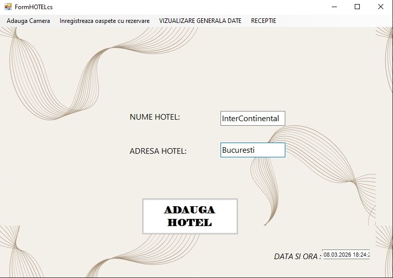
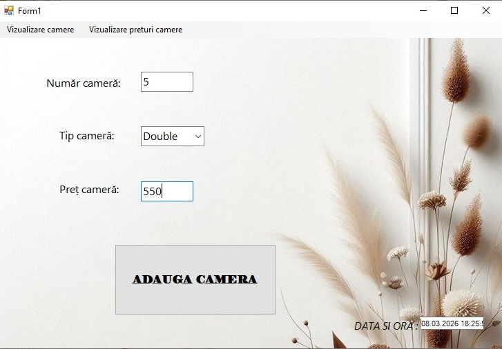
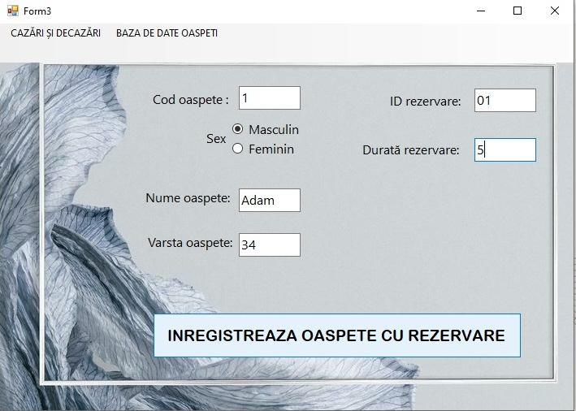
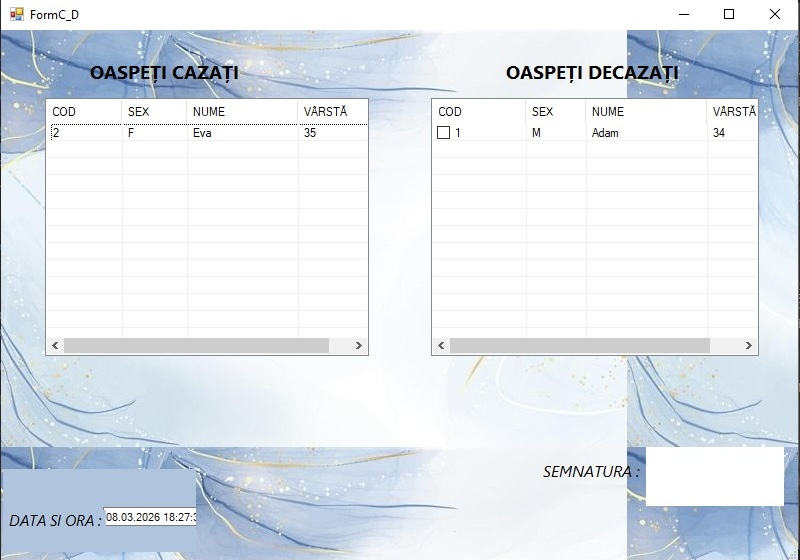
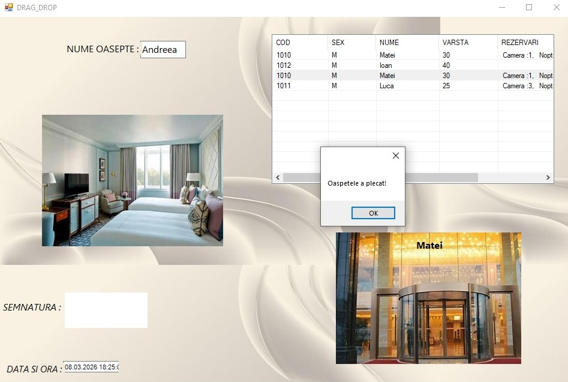
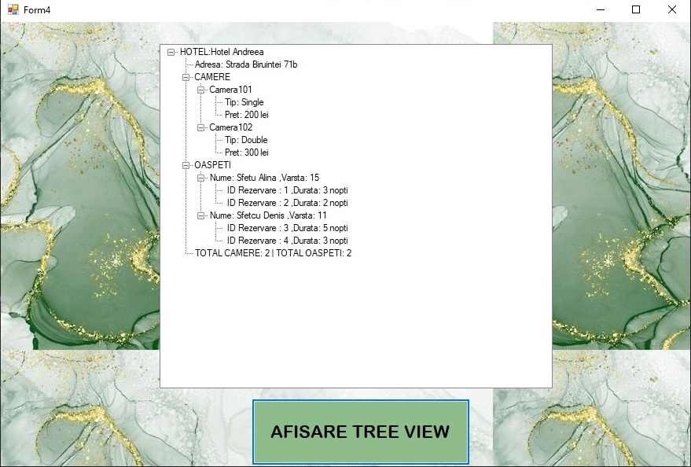
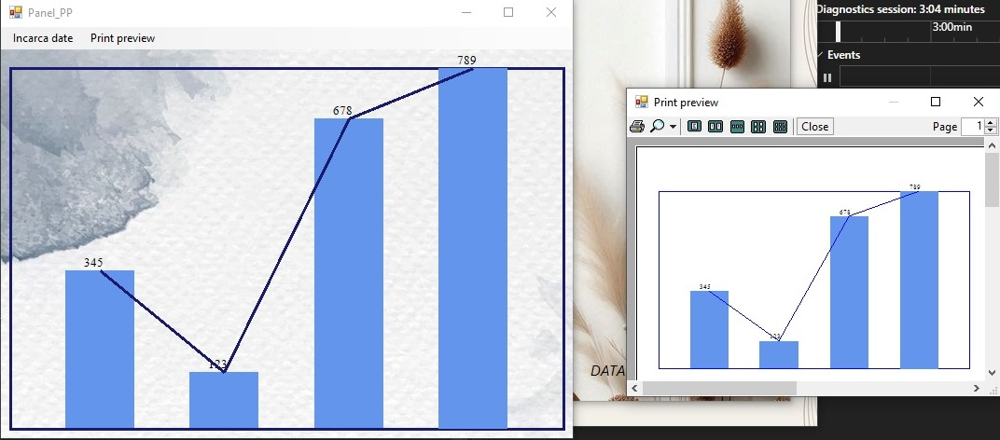

# Hotel Management System

Acesta este un proiect de tip aplicație desktop (Windows Forms) conceput pentru a facilita managementul complet al unui hotel. Aplicația oferă o interfață intuitivă pentru gestionarea datelor despre hotel, administrarea camerelor, înregistrarea oaspeților și urmărirea statusului acestora.

##  Funcționalități Principale

* **Gestiunea Hotelului:** Introducerea și salvarea detaliilor principale ale hotelului (Nume, Adresă).
* **Administrarea Camerelor:** Adăugarea de camere noi cu detalii specifice (Număr cameră, Tip cameră - Single/Double, Preț).
* **Înregistrarea Oaspeților:** Sistem de check-in pentru clienți, preluând date personale (Nume, Vârstă, Sex) și asociindu-i cu un ID de rezervare și o durată de ședere.
* **Evidența Cazărilor:** Vizualizarea clară a oaspeților cazați și a celor decazați, folosind tabele de date (DataGrids).
* **Modul Recepție (Drag & Drop):** Funcționalitate interactivă de *Drag & Drop* pentru a realiza rapid check-out-ul oaspeților, însoțită de confirmări vizuale.
* **Afișare Ierarhică (Tree View):** O structură arborescentă care permite vizualizarea ușoară a relațiilor dintre Hotel -> Camere -> Oaspeți și Rezervări.
* **Rapoarte Grafice și Print Preview:** Generarea de grafice statistice (Bar & Line charts) bazate pe datele hotelului și posibilitatea de a previzualiza (Print Preview) documentul înainte de imprimare.

## Interfața Aplicației

Mai jos sunt prezentate ecranele principale ale aplicației:

### 1. Pagina Principală - Adăugare Hotel

### 2. Gestiunea Camerelor

### 3. Înregistrare Oaspeți cu Rezervare

### 4. Baza de Date - Evidență Oaspeți Cazați și Decazați

### 5. Recepție interactivă (Drag & Drop)

### 6. Vizualizare Ierarhică (Tree View)

### 7. Rapoarte Grafice și Print Preview

---
*Proiect realizat pentru disciplina PAW.*

Andreea S.
